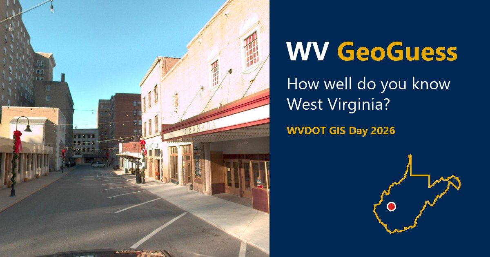

# WV GeoGuess

A live, audience-participation geo-guessing game for **WVDOT GIS Day** (November 13, 2026). A photo of
a place in West Virginia goes up on the projector. Everyone in the room drops a pin on a WV map on their
phone. The host reveals the answer and everyone's guesses, and a leaderboard runs all day.



**Live site:** https://sevin47.github.io/WV-GeoGuess/

| Page | For | What it does |
|---|---|---|
| [`host.html`](host.html) | The presenter's laptop, on the projector | Lobby with QR code, rounds with a timer, the reveal map, leaderboard, and champion. Keyboard and clicker controls. |
| [`play.html`](play.html) | Audience phones | Join with a nickname (no sign-up), guess on a WV map, zoom the photo, see your result and rank. |
| [`index.html`](index.html) | Anyone, after the event | "Play at home" solo mode: 10 random rounds from the photo pool. |

Everything is static HTML/JS with no build step. The only backend is ArcGIS Online hosted layers:
- the answers are **private** and only the signed-in host reads them
- phones read a public read-only state view
- phones submit guesses to an add-only, blind view

## Docs

| | |
|---|---|
| [`docs/RUNBOOK.md`](docs/RUNBOOK.md) | **Event day**: checklist, controls, fallbacks, after-event steps |
| [`docs/AGOL_SETUP.md`](docs/AGOL_SETUP.md) | Creating and checking the ArcGIS Online layers |
| [`docs/CONTENT.md`](docs/CONTENT.md) | The round-photo pipeline (WVDOT dashcam frames and Mapillary) |
| [`docs/NOTES.md`](docs/NOTES.md) | Engineering notes, findings, and test results by phase |
| [`WV-GeoGuess-Brief.md`](WV-GeoGuess-Brief.md) | The original project brief |

## Develop

Start the no-cache local server:

```bash
python scripts/serve.py
```

Run the unit tests (Node 22+):

```bash
node --test
```

- **Two tabs, no ArcGIS Online:** open `host.html?backend=mock&session=test-dev` in one tab and
  `play.html?backend=mock&session=test-dev&poll=always` in another.
- **Against the real layers:** `host.html?session=test-…` (the host signs in with ArcGIS). The host can
  only write `test-…` sessions and the event session listed in `config.js` → `live.eventSessions`.
- **Load test:** run `node tools/bots.mjs --session test-load-1 --bots 200`, then drive the host on
  that session.
- **Other tools:**
  - `tools/check-agol.html`: layer security check
  - `tools/tent.html`: printable QR table tent
  - `tools/review.html`: photo review
  - `tools/harness.html`: backend test page (add `?backend=mock`)

Settings live in [`config.js`](config.js).

## Credits

- Forked from [ArcGIGuess](https://github.com/aelhussiny/ArcGIGuess) by Ahmad El Hussiny (MIT
  License), built on the [ArcGIS Maps SDK for JavaScript](https://developers.arcgis.com/javascript/).
- Round photos:
  - WVDOT dashcam frames
  - [Mapillary](https://www.mapillary.com/) contributors, CC BY-SA 4.0, credited on each photo at reveal
- Place names: © [OpenStreetMap](https://www.openstreetmap.org/copyright) contributors (ODbL).
  Fun facts: [Wikipedia](https://en.wikipedia.org/) (CC BY-SA).
- WV boundary, counties, and places: U.S. Census Bureau TIGERweb.

Released under the [MIT License](./LICENSE).
